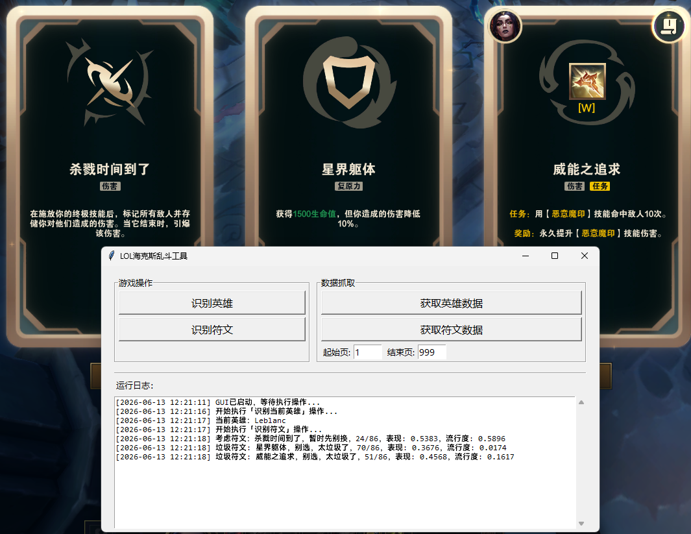

# ARAM Mayhem Helper

## 介绍

一个海克斯乱斗小帮手。
针对《英雄联盟》海克斯乱斗模式的辅助工具，为玩家提供符文选择建议。

**核心功能**:

- 通过OCR识别游戏中的符文选项
- 根据当前英雄和符文数据，智能推荐最优符文选择
- 支持命令行（CLI）、图形界面（GUI）和网页（Web）三种交互方式

## 效果展示



## 工作流程

1. **数据爬取**: 从OP.GG和Data Dragon API爬取英雄和符文数据
2. **英雄识别**: 通过League Client API获取当前游戏中的英雄
3. **符文识别**: 使用OCR识别屏幕上的符文选项
4. **智能推荐**: 基于算法模型，综合考虑表现和流行度，给出符文选择建议

## 安装说明

### 1. 安装 uv

uv 是一个快速的 Python 包管理器，推荐使用：

**Windows (PowerShell)**:

```powershell
powershell -c "irm https://astral.sh/uv/install.ps1 | iex"
```

**Linux/macOS**:

```bash
curl -LsSf https://astral.sh/uv/install.sh | sh
```

或者使用 pip 安装：

```bash
pip install uv
```

### 2. 克隆项目

```bash
git clone https://github.com/DracoYus/aram_mayhem_helper.git
cd aram-mayhem-helper
```

### 3. 安装依赖

使用 uv 安装项目依赖：

```bash
uv sync
```

注册模块：

```bash
uv pip install -e .
```

### 4. 配置说明

配置文件位于 `config/config.toml`，可根据需要调整：

```toml
[crawler]
timeout = 30              # 请求超时时间（秒）
delay_second = 2           # 爬取延迟（秒）

[suggest]
immediate_select_weighted_sum_threshold = 0.6      # 快选阈值
immediate_select_precentage_threshold = 0.15         # 快选百分比阈值
consider_select_weighted_sum_threshold = 0.45       # 考虑阈值
consider_select_precentage_threshold = 0.3          # 考虑百分比阈值
```

## 使用说明

### 命令行模式 (CLI)

```bash
# 运行主程序（识别英雄并推荐符文）
uv run python -m aram_mayhem_helper.cli main

# 爬取英雄数据
uv run python -m aram_mayhem_helper.cli champion-crawler

# 爬取符文数据（OP.GG）
uv run python -m aram_mayhem_helper.cli aram-augment-crawler

# 爬取符文数据（aramkit.com，第二数据源）
uv run python -m aram_mayhem_helper.cli aramkit-crawler
# 可选参数: --start-id 1 --end-id 999 --dataset all|high（high 为高分段数据）

# 启动网页应用，浏览符文数据
uv run python -m aram_mayhem_helper.cli web
```

### 图形界面模式 (GUI)

```bash
uv run python -m aram_mayhem_helper.gui
```

GUI界面提供以下功能：

- **识别英雄**: 点击按钮识别当前游戏中的英雄
- **识别符文**: 点击按钮识别屏幕上的符文选项并显示推荐结果
- **实时日志**: 界面下方显示运行日志

### 网页模式 (Web)

```bash
uv run python -m aram_mayhem_helper.cli web
# 可选参数: --host 127.0.0.1 --port 5000
```

页面顶部下拉可切换数据源（OP.GG / Aramkit），API 端点支持 `?source=opgg|aramkit` 参数。

### 数据源说明

- 支持 **OP.GG** 与 **aramkit.com** 两个独立数据源，互不影响、可随时切换
- 默认数据源由 `config/config.toml` 中 `[data_source] source` 配置（`"opgg"` / `"aramkit"`），GUI/CLI 主流程读取该配置
- 两源数据在引擎归一化层统一缩放到 0~1 后再打分，结果可直接对比

浏览器打开 `http://127.0.0.1:5000` 即可使用。

网页界面提供以下功能：

- **英雄列表**: 首页展示所有已缓存英雄的卡片网格，支持搜索
- **符文详情**: 点击英雄查看该英雄的全部符文数据及综合评分
- **多维排序**: 支持按符文名称、等级、表现、流行度、综合评分排序
- **灵活筛选**: 支持按等级（0/1/2）、最低表现、最低流行度筛选

### 独立部署 (低性能服务器)

Web 应用可脱离完整项目独立部署，仅需 `flask` + `numpy`（约 50MB），无需 PaddleOCR/PaddlePaddle（~2GB）。

```bash
# 1. 构建部署包（复制数据文件）
python deploy/build.py

# 2. 安装依赖并启动
cd deploy
pip install -r requirements.txt
python app.py

# 3. 或使用 Docker
docker build -t aram-web deploy/
docker run -p 5000:5000 aram-web
```

## 技术栈

- **Python**: 3.12
- **OCR识别**: PaddleOCR 2.9.1
- **深度学习框架**: PaddlePaddle 2.6.2
- **HTTP请求**: requests
- **Web框架**: Flask
- **GUI框架**: tkinter
- **数据处理**: numpy
- **配置管理**: TOML
- **包管理**: uv
- **代码规范**: ruff

## 常见问题

### Q: OCR识别不准确怎么办？

A: 可以调整以下参数：

- 确保游戏窗口在前台且不被遮挡
- 检查屏幕分辨率是否与配置匹配
- 调整OCR识别区域的坐标（在 `ocr_tool.py` 中）

### Q: 爬取数据失败？

A: 可能的原因：

1. 网络连接问题（程序会自动重试3次）
2. API接口变更
3. 被反爬虫限制（可以增加 `delay_second` 配置）

## 许可证

本项目仅供学习和个人使用，请勿用于商业用途。

## 贡献

欢迎提交 Issue 和 Pull Request！

## 联系方式

- 作者: DracoYu
- 邮箱: <876319691@qq.com>
